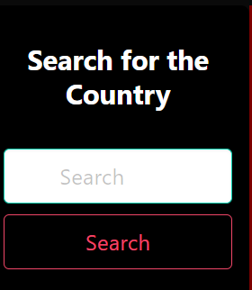

# WorldcupStats

# Deplyed URL

#User Scenarions
Initialy, web application is loaded by displaying All the 6 groups in the World cup 2022
In each group, the teams in that group will be displayed with their points, wins, losses and draws.

if the user is interested to know more information bout certain country, the user search for that coutry by entering the country name and click for search button

when the user selects a certain country, then some information about this country will be displayed such as the country flag, population, spoken languages and the currency of that country

It will also display the previous and the coming matches of that country. for each match the user will be informed with result and the date of the match and in which stage.

The user can save some countries as favorite using star button

when the web application is initially loaded, a drop-down list with all favorite countries will be loaded and the user can select his favorite country to display its informtion and matches results.

